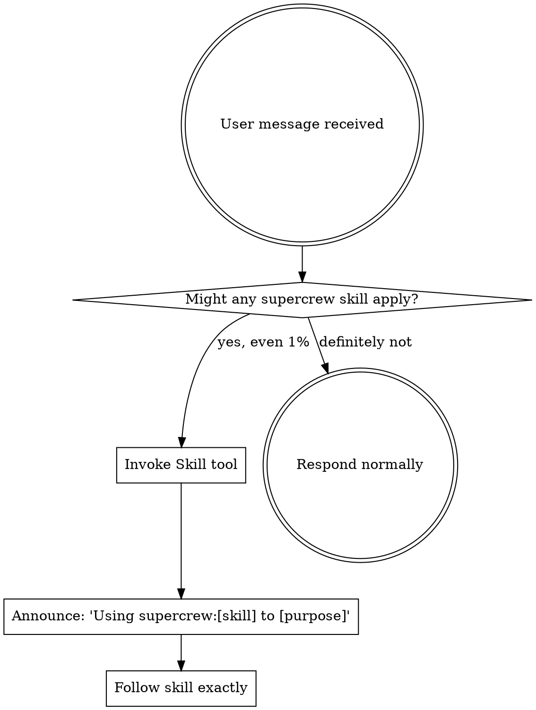

````skill
---
name: using-supercrew
description: "Use at session start to establish how supercrew skills work. Ensures features are tracked with structured lifecycle management."
---

<EXTREMELY-IMPORTANT>
If you think there is even a 1% chance a supercrew skill might apply to what you are doing, you ABSOLUTELY MUST invoke the skill.

IF A SKILL APPLIES TO YOUR TASK, YOU DO NOT HAVE A CHOICE. YOU MUST USE IT.

Invoke the relevant skill BEFORE any response or action — including clarifying questions.

This is not negotiable. This is not optional. You cannot rationalize your way out of this.
</EXTREMELY-IMPORTANT>

# Using SuperCrew

## The Rule

**Invoke relevant supercrew skills BEFORE any response or action.** Even a 1% chance a skill might apply means you must invoke it to check. If an invoked skill turns out to be wrong for the situation, you don't need to use it.

When you invoke a skill, announce it: **"Using supercrew:[skill-name] to [purpose]"**

## How to Access Skills

**In Claude Code:** Use the `Skill` tool to invoke supercrew skills by name. When you invoke a skill, its content is loaded — follow it directly. Never use the Read tool on skill files.

## When to Use Each Skill

| Trigger | Skill to Invoke |
|---------|----------------|
| User wants to create/start a new feature | `supercrew:create-feature` |
| User says "mark as ready/active/done/blocked" or status changes | `supercrew:update-status` |
| User finishes design, wants task breakdown, or tasks change | `supercrew:sync-plan` |
| User completed work, end of session, or checkpoint | `supercrew:log-progress` |
| `.supercrew/features/` exists and general lifecycle orchestration needed | `supercrew:managing-features` |

## Decision Flow



## Red Flags

These thoughts mean STOP — you're rationalizing skipping the skill:

| Thought | Reality |
|---------|---------|
| "I'll just update the file directly" | Use the skill — it ensures consistency |
| "This status change is trivial" | `update-status` validates transitions |
| "I'll log progress later" | Log NOW while context is fresh |
| "The plan doesn't need syncing" | `sync-plan` catches drift you won't notice |
| "I know the meta.yaml format" | Skills evolve. Invoke current version. |
| "The user didn't mention features" | Any coding task can involve a feature. Check first. |
| "I need more context first" | Skill check comes BEFORE clarifying questions. |
| "This is just a simple question" | Questions are tasks. Check for skills. |

## Available Commands

Users can invoke these directly:

- `/supercrew:new-feature` — Create a new feature
- `/supercrew:feature-status` — Show all features in a table
- `/supercrew:work-on <id>` — Switch active feature for this session

## Active Feature

When a feature is active (matched via `feature/<id>` branch or `/supercrew:work-on`), all skill operations target that feature by default. The SessionStart hook provides active feature context automatically.

````
